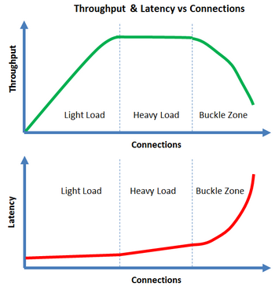

#  **< UNDER CONSTRUCTION >**

# Troubleshooting: Hardware Resource Contention

### About Hardware Resource Contention

This section is dedicated to the byproducts of the competition for shared *underlying computing resources* (CPU, RAM, disk IO and Network IO) between CockroachDB node processes and execution threads.

The material in this section applies to all supported platforms and deployments - bare metal, containerized, private cloud, public cloud.

The underlying resource contention *mainly* develops in the underlying *hardware servers* or in the *hardware partitions* created by virtualization or containerization, running CockroachDB node process(s). However, hardware resources shared by individual hardware servers, such as networking equipment, can also become contention bottleneck. [TODO: network and network connected storage]

### Identifying CPU Contention

CPU contention is a concern in its ultimate form - when the demand for CPU exceeds the available CPU resources, i.e. when essential CockroachDB services are starved from CPU.

##### Notable points

zzzz

