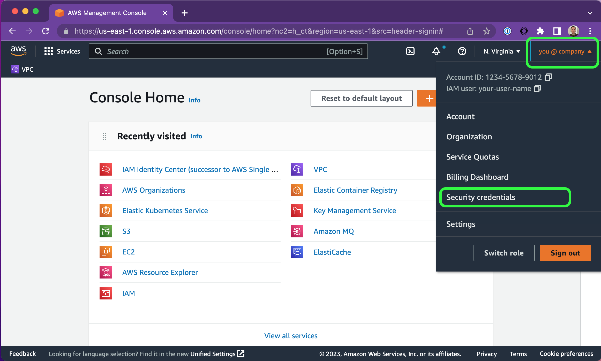
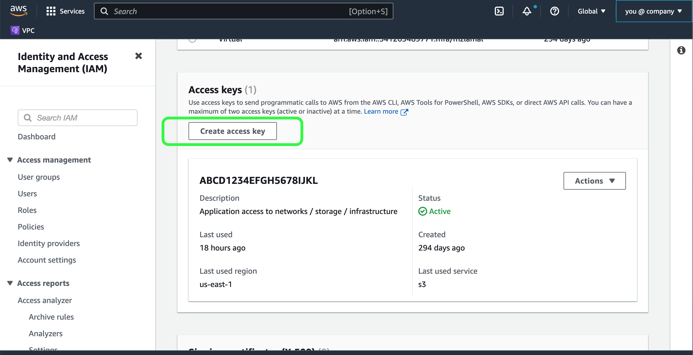
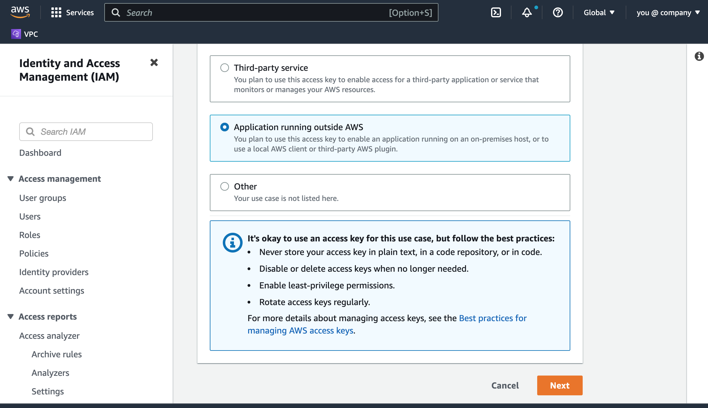
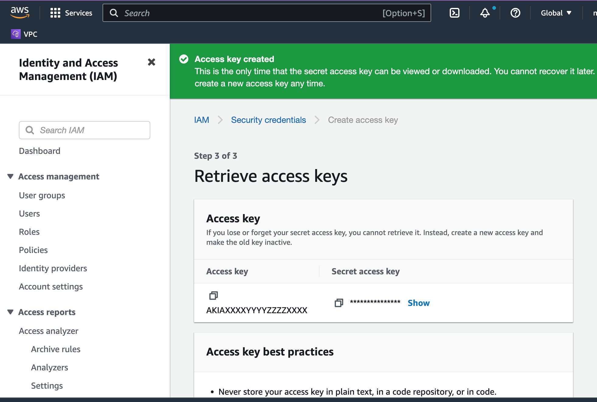

# Creation of an AWS IAM Key to operate on S3 resoures

This **one-time** procedure will establish credentials that CockroachDB uses for integrated S3 data operations. Once created, this **IAM Key** can be used across all your CockroachDB clusters and buckets managed by AWS S3. 

## Requirments

- Existing AWS cloud account with admin privileges

## Considerations and Caveats

- Access keys in AWS allow applications to interact with AWS services that are provisioned by the account owner. These keys must be kept secret within your organization, in accordance to your security policies.

- In AWS, only 2 keys are typically allowed in your named account. If you already have 2 keys established, then it's save to re-use these with CockroachDB, and this runbook procedure can be skipped.

## Procedure

1. Sign in to your AWS account: https://signin.aws.amazon.com

2. Navigate to your user-profile view, and select _**Security credentials**_

  

3. Scroll down to **Access keys** and select _**Create access key**_

  

  _You may already have an existing key present that is used by other applications, projects, activities, or groups._

4. Select _**Application running outside AWS**_ and click **Next**

  

5. Once the key is created, this is your only chance to save it for consumption.

  

  Be sure to save the _visible_ **Access key ID** and the _hidden_ **Secret access key**.

  Both of these IAM key parts will be used by CockroachDB to execute backup and restore operations.

## AWS best practices for managing Keys

For more details about managing access keys, see the [Best practices for managing AWS access keys](https://docs.aws.amazon.com/console/general/access-keys-best-practices).
