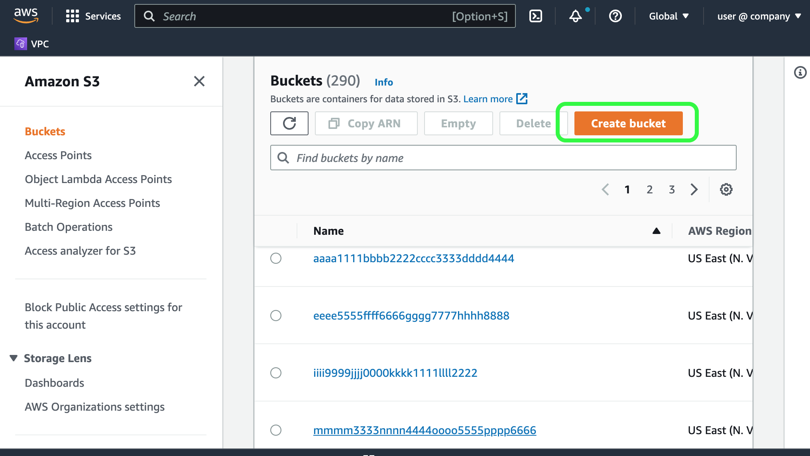

# Creation of an AWS S3 storage bucket for backup data

This **one-time** procedure will prepare an S3 storage bucket that will hold all your backup data files.

## Requirements

- Existing AWS cloud account with admin privileges

## Considerations and Caveats

- **Buckets are tied to a particular AWS region.**
  - Best practice is to pick a region that is physically closest to your site geography to help reduce public network latencty.
  - For in-cloud CockroachDB deployments, use an AWS region that matches (or is closest-to) the region of your workloads for optimal network performance.
- **Keys and encryption**
  - Based on your corporate security policies and compliance, you can choose default security keys offered by AWS, or you can specify keys that are managed by your organization. Work with your CISO or security team to apply security keys if required.
- **Management of Buckets**
  - An AWS storage bucket can accommodate many full and incremental backups.
    Each backup is organized by internal folder-structures that are labelled using date and time-stamps to identify when the backup was completed.
  - You can rename and move the backups at the root-folder-level if needed for organization, but you must **not** edit the files inside the folders to preserve the integrity of the backup.
  - You can create multiple buckets to help organize your backups by CockroachDB cluster, by team, by project, or other methodologies to suit your needs.
  - AWS S3 provides long-term bucket storage tiers for your data to save on costs.
  The intent is to push backups into reliable *cold* storage where the retrieval is less-frequent and support higher data durability SLAs. 

## Procedure

1. Sign in to your AWS account: https://signin.aws.amazon.com

2. Search for S3, and choose the S3 service

  

3. Scroll down to **Buckets** and click _**Create bucket**_

  

4. Specify your _**Bucket name**_ and the _**AWS Region**_

  

5. This UI lets you specify additional properties including visibility and encryption-key policies.  Scroll down and confirm the following settings on this new storage bucket as follows:

 - ACLs disabled (recommended)
 - Block _all_ public access
 - Bucket Versioning: **Disable**
 - Default encryption: Amazon S3-managed keys (SSE-S3)
 - Bucket Key: Enable
 - Click _**Create Bucket**_

Once the bucket is created, a green UI message will be presented indicating the bucket was created with a link to the details.
