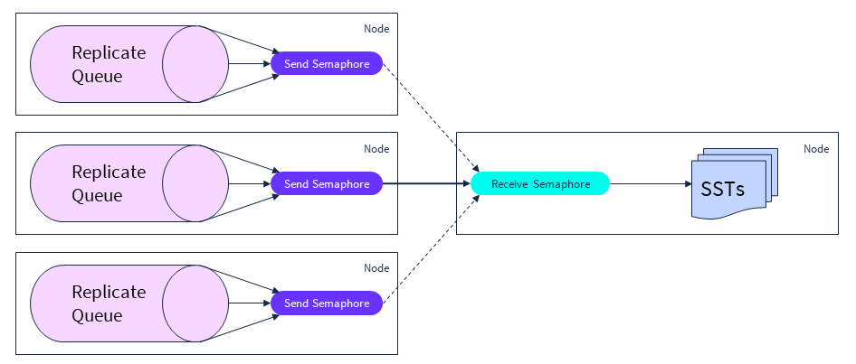
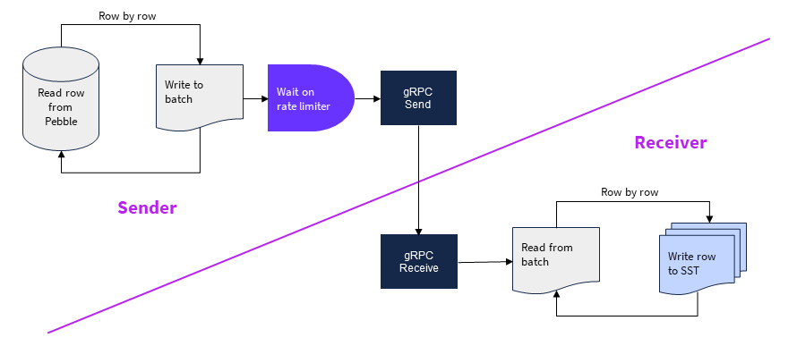

# Procedure:  Set Snapshot Rebalance & Recovery Rates

### About this Procedure

The 2 cluster settings - `kv.snapshot_rebalance.max_rate` and `kv.snapshot_recovery.max_rate` allow an operator to control the speed of the elastic data rebalancing and of up-replication to restore the designed replication factor.

These settings limit the raft snapshot transfer rate *on the sender*. If a node (store) is sending a snapshot faster than the this rate cap, the sender is throttled down to that rate.

The *Rebalance* rate is used for moving replicas between cluster nodes for uniform range distribution, load-based rebalancing, range splits & merges, and user actions.

The *Recovery* rate is used for up-replication of replicas to meet its survival goals, for example after a node failure.

The snapshot transfer mechanism is the same, but the transfer priority is different - recovery has a higher priority than rebalance.

> ✅  The 2 cluster settings `kv.snapshot_rebalance.max_rate` and `kv.snapshot_recovery.max_rate`  **should always be set to the same value**. 


### Node Decommission Implementation Highlights

**Snapshot Process**




**Snapshot process Zoom-In**



- A snapshot encapsulates one range, up to about 512 MB in size
- A node can send 1 snapshot at a time
- A node can receive 1 snapshot at a time
- Max rate configuration settings limit the sender's rate
- A receiver endures heavier load and is effectively another limiting factor


### Considerations for Setting the Max Rates

The default values for the max rates is 32 MB/s. It is very conservative for most real-world workloads.

> ✅  Operators are encouraged to weigh in all considerations and set the cluster's max rates once for *all* routine maintenance and emergency operations. Setting the rates to different values by an operating procedure is risky and therefore not recommended.


**Benefits of Higher Snapshot Rates**

A faster recovery of the designed replication factor. For example, after a node failure, the cluster will self-heal faster, thus limiting the risks of a service disruption.

A faster rebalancing rate makes a cluster more elastic, enabling an operator to react more nimbly on workload changes. For example, expanding a "hot" cluster allows new nodes to start handling the workload quicker, thus reducing the CPU pressure on the "hot" nodes in the cluster.

A faster cluster rebalancing to reach a steady state is generally beneficial for operational stability.

A faster data rebalancing minimizes the leaseholder movements during topology changes e.g. cluster expansion. This keeps the response time SLA (for example, if based on P90/P99) consistent because it reduces the probability (frequency) of internal retires due to "not a leaseholder" errors.

**Concerns with Higher Snapshot Rates**

Very high snapshot rates may interfere with the network traffic that supports user workloads.

A snapshot receiver has more storage level work to do, particularly new writes. In situations when a receiver node is running "hot" on CPU and/or disk IO, a higher snapshot transfer rate may cause an increase in read amplification if the node (store) doesn't have the bandwidth to handle the added write traffic.

**Selecting the Snapshot Rates**

CRL's customer experience shows that 256 MB/s is a good setting for most real world-workload.

Capping the network allocation for rebalancing / recovery snapshots does not compromise the network bandwidth necessary to support user workloads. CockroachLabs recommends 10Gb or better network. 250 MB/s is no more than 20% of the total available network bandwidth. That leaves at least 8Gb/s to support SQL workload related data transfers, which is sufficient. 

> Increasing the max rates from the recommended 256 MB/s to a higher rate is not expected to have any effect in v22.2 or earlier. Increasing the cap doesn't mean that the sender *is able* to send a snapshot any faster or the receiver can *apply* it faster. The effective snapshot transfer rate depends on CPU and disk IO resources, as well as implementation algorithm. In the v22.2 or earlier, the slowest part of the snapshot transfer pipeline bottleneck is the receiver. The recommended 256 MB/s rate cap is higher than what the receiver can process in the current implementation.


### Procedure Steps

Increase the maximum rebalance and recovery rates to 256 MB/s by setting two configuration options to the *same value*:

```
 set cluster setting kv.snapshot_rebalance.max_rate = '256 MB';
 set cluster setting kv.snapshot_recovery.max_rate = '256 MB';
```

