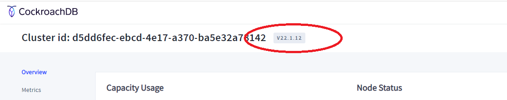

# Procedure:  Release Upgrade and Downgrade

### About this Procedure

This section supplements to the documented [CockroachDB version upgrade](https://www.cockroachlabs.com/docs/stable/upgrade-cockroach-version.html) procedure with clarifications for topics that operators have raised with Cockroach Labs field engineers.

While the general outline of an upgrade procedure remains largely the same between releases, operators are strongly encouraged to check the documented guidance for *each* target release for possible release-specific actions, deprecated features, and backward-incompatible functionality changes.


### About CockroachDB Release Numbers

A CockroachDB version consists of three numbers and an optional suffix - [Y.R.P-S](https://www.cockroachlabs.com/docs/releases/index.html#release-naming). For example, `22.1.12`, `22.2.0-rc.3`

The leading two numbers taken together Y.R denote a CockroachDB major release. The major release version describes a stable, documented feature set.

The third number P denotes a patch (or maintenance) release. Patch releases include sets of fixes for software defects. Patch release numbers increment monotonously and indicate the stability level progression within a major version. Starting with some patch release number, Regular releases are promoted to a Long Term Support (LTS) series, indicating the  

A hyphen separated suffix `S` may be used for internal versioning purposes (not necessarily visible to users) and in previews. Production releases do not use a suffix in the version number. 


### CockroachDB Versions

There are two "version" contexts that operators should be versed in:

- **The version of CockroachDB software a node is running.** This is the version built into every CockroachDB node executable (binary). Under the normal operating conditions, the versions of the executable on all cluster nodes match exactly. However, during a limited period of time a cluster can be operated with different versions of CockroachDB node executables across the cluster nodes. This is an important aspect of the software design that enables upgrades without service interruptions, whereby individual nodes are upgraded one at a time in a rolling fashion. 
- **The version of on-disk format.** This is the format version of CockroachDB data and metadata stored in [Pebble](https://www.cockroachlabs.com/docs/stable/architecture/storage-layer.html#pebble) [SST](https://www.cockroachlabs.com/docs/stable/architecture/storage-layer.html#ssts) files. Under the normal operating conditions, the major versions of the node's executables matches the major version of the on-disk format. However, during a limited period of time, e.g. during a major release upgrade before the upgrade is finalized, a cluster can be operated with mismatching versions of CockroachDB node executables and the cluster's on-disk format version. This is another important aspect of the software design that enables upgrades without service interruptions.


##### CockroachDB Node Software Version

Operators can use either of the 3 methods to view the node's software version. Note that different cluster nodes may be running different version executables.

1) Via SQL interface:

```sql
-- the software version *of the node that the SQL client is connected to*

defaultdb> SELECT node_id, sql_address, build_tag FROM crdb_internal.gossip_nodes WHERE node_id = crdb_internal.node_id();
  node_id |   sql_address   | build_tag
----------+-----------------+------------
        2 | lexington:27002 | v22.1.12
(1 row)


-- the software versions of all nodes of the cluster

defaultdb> SELECT node_id, sql_address, build_tag FROM crdb_internal.gossip_nodes ORDER BY 1;                          
  node_id |   sql_address   | build_tag
----------+-----------------+------------
        1 | lexington:26257 | v21.2.17
        2 | lexington:27002 | v22.1.12
        3 | lexington:27003 | v21.2.17
(3 rows)
```


2. Via OS level (shell) command:

```shell
% cockroach version --build-tag
v22.1.12
```


3. Via CockroachDB Console

   

   The software version is in the upper right area (next to the cluster id) of the "Overview" tab.


##### On-disk Data Format Version

The version of the current *cluster-wide* on-disk format is reported via the cluster setting `version`:

```sql
defaultdb> show cluster setting version;
  version
-----------
  21.1
```

> ✅ The cluster setting `version` is maintained by the database software. Users should not attempt to modify this setting with `set cluster setting`.


##### Versioning Design Highlights

- All CockroachDB software upgrades are "rollable", by design. This applies to major and patch release upgrades. This is possible because the software is designed to allow operations for a limited time with mis-matched versions of the executable (binary) and/or on-disk data format versions.

- Every CockroachDB node software executable is able to read and write two versions of on-disk format - the on-disk format version that matches the major version of the node executable and the previous major version of the node executable. For example, 22.1 node software can read and write on-disk data formats 22.1 (matching major) and 21.2 (previous major). 

- Different major versions of on-disk data format are *incompatible*. The on-disk format can upgraded but can *not* be downgraded. This has a principled effect on available release [downgrade](#release-downgrade) options.

- During a major release finalization, a cluster may run a series of jobs to process *internal* on-disk format upgrades. This processing is automatic and requires no user intervention. During this time the `show cluster setting version` will be reporting a progression of applied internal on-disk format changes, with versions including hyphen separated suffixes.

- Cockroach Labs is enforcing the development practice of maintaining the on-disk format and inter-node communication protocols unchanged within the series of patch releases of a major version. The current practice stipulates, however, that it is permissible to break backwards-compatibility under extraordinary circumstances such as discovered security vulnerability with an extreme impact. Historically, there had been no case of backward incompatible patch releases. 


### Major Release Types

Prior to June 2024, only one type of CockroachDB major release was generally available at the cadence of two (2) releases per calendar year.

[After v24.2 (August 2024)](https://www.cockroachlabs.com/docs/releases/#upcoming-releases), the release cadence shifted from a 6 months cycle to a 3 months cycle and a new release type, called "Innovation" release, was introduced in addition to the previous release type that is now called "Regular". Regular and Innovation releases are interleaved, with Regular releases continuing the same cadence of two (2) releases per calendar year.

Cockroach Labs' eventual goal is to support one major upgrade per year.

At present, Innovation Releases are *optional.* They can be “skipped” over when upgrading.

At present, Regular releases can not be "skipped" over. Customers must upgrade to every new Regular major release at the cadence of 2 / year.


##### Supported Upgrade Paths for Regular Releases

The current Regular major release can be upgraded ***to either the next Regular, or to the next Innovation*** major releases.

A planned Regular major releases can be upgraded to ***from the previous Regular, or from the previous Innovation*** major releases.


##### Supported Upgrade Paths for Innovation Releases

The current Innovation major release can be upgraded ***only to the next Regular*** major release.

A planned Innovation major releases can be upgraded to ***only from the previous Regular*** major release.


##### Long Term Support (LTS) Regular Release Designation

LTS designator indicates "the highest level of expected release stability and performance". Innovation releases do not have LTS releases. [[doc quotes](https://www.cockroachlabs.com/docs/releases/release-support-policy.html#regular-releases)].

Every Regular major release is promoted to LTS after its series of patch releases demonstrates a continuously high level of stability and performance. Promotion to LTS is a deliberate process that includes (but not limited to) these quality benchmarks (the minimum thresholds, KPIs, and benchmarks may and likely will change over time):

- A minimum of three month time since the GA release
- A minimum of 1.5M non-idle CPU hours of cumulative consumption since the GA release in CockroachDB Cloud Dedicated
- Meet all check boxes of the “Quality Gates”. The Quality Gates list is extensive and accounts for open software defects, closed defects, performance regressions, technical advisories, etc.


##### FAQ

Q1: *Prior to the introduction of Innovation major releases, we were required to upgrade to a new major release 2 times per year.  With the new quarterly cadence of major releases, will we be required to upgrade more frequently than 2 times per year?*

A1: No. There is no change whatsoever for customer who elect to stay on Regular releases only - same upgrade cadence of 2 / year. These customers will be able to upgrade from one Regular release to the next Regular release, skipping Innovation releases entirely.  Cockroach Labs' eventual goal is to reduce the minimum required upgrade cadence to 1 / year.

Q2: *[Maintenance support period](https://www.cockroachlabs.com/docs/releases/release-support-policy#support-phases) for Regular Long Term Support (LTS) releases has been increased to 1 year. Does it mean we are required to upgrade to a new major release only 1 time per year if we use LTS?*

A2: No, it does not. See A1.

Q3: *If we decide to upgrade to an Innovation release, will we have to do major version upgrades more than 2 / year?*

A3: Yes. Innovation release customers must plan to upgrade to the next Regular release and can only upgrade from the previous Regular release. This means the use of every Innovation release increases the minimum number of major version upgrades per year by one.

Q4: *Can I install Innovation release in production?*

A4: Yes. Note, however, that Innovation releases do not have an [Assistance Support period](https://www.cockroachlabs.com/docs/releases/release-support-policy#support-phases) and Maintenance support period is only 6 months. Innovation release customers are expected to upgrade to the next Regular major release when it's available.


### Release Upgrade

For procedural guidance, follow the [doc](https://www.cockroachlabs.com/docs/stable/upgrade-cockroach-version.html) as *the* reference.


##### Considerations for Production Deployment's Release Version

> Considerations is this section are only for routine, planned software upgrades. Updates due to required new functionality or critical fixes are obviously driven by other considerations not discussed herein.

A database software version update requires planning, QA efforts, and IT operations time to apply the update. A common practice within IT organizations is to *minimize the number of software updates* while always running a [supported release](https://www.cockroachlabs.com/docs/releases/release-support-policy.html#current-supported-releases).

A new major version of CockroachDB is released about *every 6 months*. "Skipping" or delaying a major upgrade can not result in time/resource savings because CockroachDB supports major version upgrades from the previous version only.  "Leaping over" a major version upgrade is not possible.

To maintain supportability of the CockroachDB software, an operator at the minimum has to upgrade once to every major release.

Within a major release, the patch release numbers increment monotonously and indicate the stability level progression. In most cases, the most recent patch version within a series is the best choice for a production deployment.

*For risk averse operators*, the following may be practical:

- Only consider upgrading to Regular major releases that have been promoted to LTS status.
- Adopt the minimal cadence of major version updates that matches CockroachDB major release cadence - at present it's about every 6 months (or 2 / year).
- Stay one major release behind. Cockroach Labs supports 2 latest Regular major releases. When a new Regular major version is released, it's generally the time to upgrade to the Regular version before the latest.
- There should be no need to make repeated patch upgrades as long as no defect affecting operations is discovered.
- Determine the earliest patch release candidate that is sufficiently hardened for a production deployment. For recent Regular releases, risk-averse operators can wait until a Regular release is promoted to LTS status, then select a patch release from the LTS series. For releases v22.2 and earlier, choosing a patch release isn't an "exact science" but a good faith, educated guess. The Release Notes published in the doc for each patch release include the list of bug fixes that an operator can track. A shrinking list  of bug fixes for a couple of consecutive patch releases  and a perceived "blast radius" of fixed bugs may serve as a gauge of release's stability. Historically, after 5-7 patch releases, the major release is sufficiently hardened for a production deployment and the operator can plan the QA cycle in staging. Lock a production deployment candidate by downloading the latest patch release shortly prior to starting the release validation in QA.
- In summary, this rule of thumb may work well: "use the latest LTS (hardened) patch release of the previous Regular major version".


### Release Downgrade

If a new release upgrade causes operational problems, an operator can undo (downgrade) a patch release upgrade or an *unfinalized* major release upgrade.


##### Patch Release Downgrade

Patch releases are backward-compatible improvements within major versions of CockroachDB. On-disk data format does not change between patch releases.

Operators can update (downgrade or upgrade) the patch release version by "rolling the cluster" and replacing the node executable (binary) with any prior or future patch release within the same major release. There is no finalization during patch release updates.


##### Major Release Downgrade

*Before* a major release upgrade *is finalized*, the on-disk data format doesn't change, i.e. it matches the previous major version. This means that a major version downgrade (before the cluster was finalized) is the same procedure as a [*patch* release downgrade](#patch-release-downgrade). The operator would "roll the cluster" and revert all node executables to the previous major version.

However, if a major cluster upgrade *has been finalized*, the on-disk data format is upgraded and the cluster can *NOT* be downgraded to any previous major release version. The only available path to revert to the prior major version is restoring a cluster backup.

A risk averse operator would plan precautionary steps and maximize the opportunity for a version downgrade in case a major release upgrade exposed an unexpected issue:

- Always [disable auto-finalization](https://www.cockroachlabs.com/docs/stable/upgrade-cockroach-version.html#step-3-decide-how-the-upgrade-will-be-finalized). After the executables (binaries) on all nodes of the cluster have been upgraded, operate the cluster for a small number of days to gain confidence in the new release. Manually finalize the upgrade when the upgrade is perceived successful.
- Take a full cluster backup immediately prior to manually finalizing the upgrade. This will provide a restore savepoint should a disruptive issue be discovered after the cluster is finalized.


### Finalizing a Major Release Upgrade

A major upgrade should not be left un-finalized for an extended period of time, beyond a small number of days necessary to gain confidence in the new release.

To check whether or not a major release has been finalized, run the following query:

```sql
SELECT count(*) = 0 AS last_upgrade_is_finalized
FROM crdb_internal.kv_node_status WHERE server_version != (SELECT version FROM [show cluster setting version]);
```

If the query returns `true` - the last major upgrade has been finalized. If `false` - the upgrade is in an un-finalized state which may require an operator's action.


### FAQ

**Q:**  We upgraded our cluster from `21.2.15` to `22.1.9`. The DB Console now shows version `22.1.9`, however the `show cluster setting version` displays `21.2-20`. Please explain the difference.

**A:**  This is a [difference between the versions](#cockroachdb-versions) of an executable (binary) and on-disk data format. Until a major release upgrade is finalized, these [versions may not match](#versioning-design-highlights). They will match after the upgrade is [finalized](https://www.cockroachlabs.com/docs/stable/upgrade-cockroach-version.html#step-5-finish-the-upgrade).


**Q:**  How do we interpret the result of `show cluster setting version` returning `21.1-1112`?

```
defaultdb> show cluster setting version;
   version
-------------
  21.1-1112
(1 row)
```

A repeated call returns `21.1-1126`, i.e. the version is changing over time. We upgraded to `21.2.15` and expect the cluster setting `version` to show`21.2`. Seeing `21.1-XXXX` is confusing. 

**A:**  You are observing a major version upgrade finalization going through *internal* on-disk format upgrades. This is a online background operation and requires no operator intervention. You can observe the progress details on the Jobs page in DB Console or with `show jobs`.

Major releases may include new features that require a change in the *metadata* format. When upgrade is finalized, the cluster setting `version` shows the matching major release number. In your case it will be `21.2`. At that point all features in the new release (`21.2`) are available to database users.

