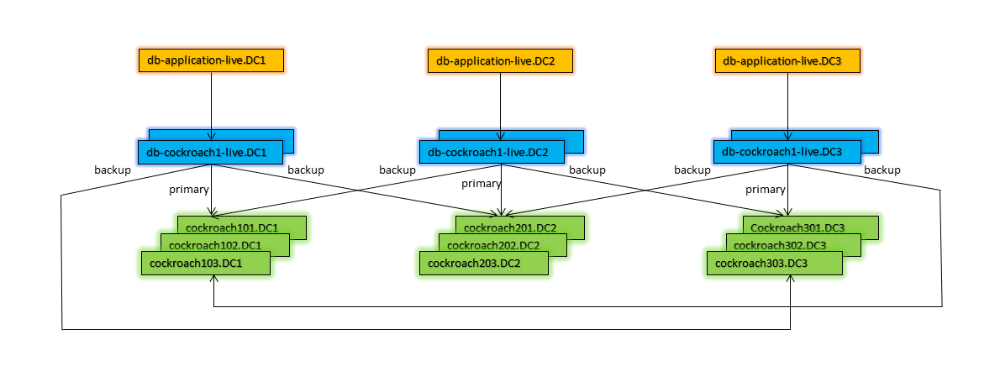
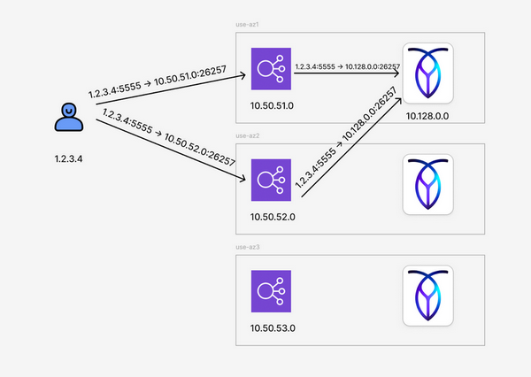

# Client Connections: Pooling, Balancing, Failover and Failback

### Overview

In a database application environment, the application connectivity may become *the weakest link* without a robust connection management. Cockroach Labs technical support has assisted customers in several cases of complete application/database service outages wherein the application lost all database connections to a heathy, operational CockroachDB cluster due to configuration errors or lax connection management.  

For continuous service availability, database connectivity requires redundancy and agile connection management, including connection governance, load balancing, failover and failback. This is commonly achieved with a combined use of load balancers and connection pooling.

***[Load balancing](#load-balancing)*** (LB) ensures:

- a balanced client connection distribution across all-peer CockroachDB cluster nodes
- client connections routing only to healthy nodes of the cluster
- [rebalances](#connection-balancing) client connections upon a database cluster size or topology change, in orchestration with connection pool settings

***[Connection pooling](#connection-pooling)*** (CP) serves these important functions:

- alleviates the open/close connection overhead
- provides workload concurrency governance
- [rebalances](#connection-balancing) client connections upon a database cluster size or topology change, in orchestration with load balancer configuration

A combination of a connection pool and a load balancer is a commonly used, proven architectural design pattern. However it is not the only valid approach. Other viable approaches exist - for example a database driver- based load balancing and failover/failback can be implemented.


### Load Balancing

CockroachDB supports [Layer 4 load balancing](https://www.haproxy.com/blog/loadbalancing-faq/), which means TCP/IP connection is established directly between the client (the application or connection pool) and a CockroachDB node. I.e. the application connection terminates at a CockroachDB node. 

The load balancers are typically configured with "round-robin" algorithm, which is the simplest, most effective and most tested.

 Upon a new cluster connection request, the load balancer selects a healthy node in the region (as determined by `/health?ready=1`) for the client to connect to. While the "round-robin" load balancing policy attempts to spread the connections evenly, there is no guarantee of a connections balance because the load balancer is not aware of the node's capacity to process the workload and because clients can close connections. These realities may lead to client connections imbalance. See [connection balancing](#connection-balancing) mitigation techniques section.


#### Load Balancing in a Self-hosted Environment (HAProxy Example)

This section includes a real world configuration example of the load balancer tier in front of a a CockroachDB cluster spanning 3 geographically dispersed data centers (DC1, DC2, DC3) with 3 CockroachDB nodes in each data center. That configuration is appropriate for the specific service continuity requirements and it's included merely as a practical example of *one possible* configuration. This example does not rise to a "recommended" or a "reference" level due to great variations in the realities of deployment platforms and service continuity requirements.

In the diagram the HAProxies are in blue:



Configuration highlights:

- Application instance in each DC connects to local HAProxies, 2 instances for redundancy.
- In an event *one* server in a DC fails, HAProxy load balances database traffic to the remaining CRDB servers in the same DC
- In an event *all* CRDB servers in a DC fail, HAProxy in that DC sends the database traffic to ALL surviving CRDB nodes in ALL OTHER DCs (option `allbackups`)
- The connections between the application and redundant HAProxies in the same DC are load balanced via round-robin DNS (A record).
- In an event an entire DC fails, or in an event the application in a DC is not available, the incoming application traffic is routed to the application(s) in the surviving DCs

The HAProxy configurations:

```tex
---------------------------------- DC1 ----------------------------------

global
  daemon
  maxconn 4096
  pidfile /var/run/haproxy.pid
  stats socket /var/lib/haproxy/stats mode 660 level admin
  nbproc 4

defaults
  mode tcp
  timeout connect 10s
  timeout client 30m
  timeout server 30m
  option clitcpka
  option allbackups

listen psql
  log global
  bind :26257
  mode tcp
  balance roundrobin
  option httpchk GET /health?ready=1
  server cockroach101 cockroach101.DC1 check port 8080
  server cockroach102 cockroach102.DC1 check port 8080
  server cockroach103 cockroach103.DC1 check port 8080
  server cockroach201 cockroach201.DC2 check port 8080 backup
  server cockroach202 cockroach202.DC2 check port 8080 backup
  server cockroach203 cockroach203.DC2 check port 8080 backup
  server cockroach301 cockroach301.DC3 check port 8080 backup
  server cockroach302 cockroach302.DC3 check port 8080 backup
  server cockroach303 cockroach303.DC3 check port 8080 backup

listen stats
  bind 127.0.0.1:9000
  mode http
  stats enable
  stats hide-version
  stats uri /haproxy_stat

---------------------------------- DC2 ----------------------------------

global
  daemon
  maxconn 4096
  pidfile /var/run/haproxy.pid
  stats socket /var/lib/haproxy/stats mode 660 level admin
  nbproc 4

defaults
  mode tcp
  timeout connect 10s
  timeout client 30m
  timeout server 30m
  option clitcpka
  option allbackups

listen psql
  log global
  bind :26257
  mode tcp
  balance roundrobin
  option httpchk GET /health?ready=1
  server cockroach201 cockroach201.DC2 check port 8080
  server cockroach202 cockroach202.DC2 check port 8080
  server cockroach203 cockroach203.DC2 check port 8080
  server cockroach101 cockroach101.DC1 check port 8080 backup
  server cockroach102 cockroach102.DC1 check port 8080 backup
  server cockroach103 cockroach103.DC1 check port 8080 backup
  server cockroach301 cockroach301.DC3 check port 8080 backup
  server cockroach302 cockroach302.DC3 check port 8080 backup
  server cockroach303 cockroach303.DC3 check port 8080 backup

listen stats
  bind 127.0.0.1:9000
  mode http
  stats enable
  stats hide-version
  stats uri /haproxy_stat

---------------------------------- DC3 ----------------------------------

global
  daemon
  maxconn 4096
  pidfile /var/run/haproxy.pid
  stats socket /var/lib/haproxy/stats mode 660 level admin
  nbproc 4

defaults
  mode tcp
  timeout connect 10s
  timeout client 30m
  timeout server 30m
  option clitcpka
  option allbackups

listen psql
  log global
  bind :26257
  mode tcp
  balance roundrobin
  option httpchk GET /health?ready=1
  server cockroach301 cockroach301.DC3 check port 8080
  server cockroach302 cockroach302.DC3 check port 8080
  server cockroach303 cockroach303.DC3 check port 8080
  server cockroach101 cockroach101.DC1 check port 8080 backup
  server cockroach102 cockroach102.DC1 check port 8080 backup
  server cockroach103 cockroach103.DC1 check port 8080 backup
  server cockroach201 cockroach201.DC2 check port 8080 backup
  server cockroach202 cockroach202.DC2 check port 8080 backup
  server cockroach203 cockroach203.DC2 check port 8080 backup

listen stats
  bind 127.0.0.1:9000
  mode http
  stats enable
  stats hide-version
  stats uri /haproxy_stat

```


#### Load Balancing in a Cloud Deployment - Google Cloud Load Balancing

In a Google cloud deployment, a regional [native load balancer](https://cloud.google.com/load-balancing/docs/load-balancing-overview) is typically provisioned to route connections to CockroachDB nodes in that region. This is an OSI Layer 4 load balancer implemented in the network fabric. It operates across AZs, with [AZ loss survivability](https://cloud.google.com/load-balancing/docs/choosing-load-balancer#outage-resilience).   

Google Cloud load balancers are typically deployed in the following configuration: [internal](https://cloud.google.com/load-balancing/docs/choosing-load-balancer#external-internal), [regional](https://cloud.google.com/load-balancing/docs/choosing-load-balancer#global-regional), in [pass-through](https://cloud.google.com/load-balancing/docs/choosing-load-balancer#proxy-pass-through) mode, optionally with [global access](https://cloud.google.com/kubernetes-engine/docs/how-to/internal-load-balancing#global_access).


#### Load Balancing in a Cloud Deployment - AWS Network Load Balancers

In a AWS cloud deployment, a regional [network load balancer](https://docs.aws.amazon.com/elasticloadbalancing/latest/network/network-load-balancers.html) with [cross zone load balancing](https://docs.aws.amazon.com/elasticloadbalancing/latest/network/network-load-balancers.html#cross-zone-load-balancing) enabled (per Cockroach Labs deployment reference) is typically provisioned to route connections to CockroachDB nodes in that region. This load balancer functions at the 4th layer of the OSI model.

CockroachDB operators in AWS cloud should be aware of the following caveats: 

###### AWS NLB Mixing Up TCP Connections

Application connections to CockroachDB via AWS NLB will experience intermittent connection drops (`connection reset` errors or timeouts) if both *client IP preservation* and *cross zone load balancing* are enabled in NLB configuration.

The impact on a user workload is a reduced SQL throughput due to reconnect and re-try overhead and/or connection timeouts.

The issue is described in [this article](https://medium.com/swlh/nlb-connection-resets-109720accfc6).  AWS provides two troubleshooting paragraphs pertinent to this issue:
https://docs.aws.amazon.com/elasticloadbalancing/latest/network/load-balancer-troubleshooting.html#loopback-timeout
https://docs.aws.amazon.com/elasticloadbalancing/latest/network/load-balancer-troubleshooting.html#intermittent-connection-failure

The issue is a logical problem in IP networking (not unique to NLB nor CockroachDB specific) called "Diamond Routing". It occurs when a client thinks it is talking to 2 different servers, when it is actually talking to the same server. In AWS, each AZ of NLB has a different IP address. A DNS lookup performed by a client returns a set of all IP addresses which belong to the NLB. When a client chooses different IP addresses for different connections, it may reuse the same source port when communicating to two different destinations. However, because of *cross zone load balancing*, the client may in fact be communicating to the same backend server (e.g. a CockroachDB node) for both connections. Because of client IP preservation, the CockroachDB node will see packets arriving from the same source IP address and source port, which appear to it as belonging to the same TCP socket. This will lead to confusion between the client and the server, and one of the connections will unexpectedly close.



The issue can be eliminated by disabling <u>either</u> *client IP preservation* <u>or</u> *cross zone load balancing*.

Since Cockroach Labs only has operating experience with *cross zone load balancing* enabled (the current deployment reference), realistically the operator's decision is whether to disable *client IP preservation* or not. Disabling *client IP preservation* will deny the database an opportunity to track client connections (all client SQL connections will be reported as originating at NLB's IP address), which may obstruct effective troubleshooting. Keeping *client IP preservation* enabled will lead to intermittent performance “dips”, which perhaps may be acceptable since there should be no service continuity disruptions.

In v24.3+ CockroachDB has a feature that allows the cluster to maintain client IP information when NLB's *client IP preservation* is disabled. It leverages Proxy protocol v2 (supported by NLB) that maintains the original client address information in a special header when transferring data through a proxy which rewrites the source IP address. To enable this feature in CockroachDB 24.3 or later:

1. Start ***all*** cluster nodes with the  `--accept-proxy-protocol-headers` flag. This flag is not documented, but discoverable with online help `cockroach start --help`.
2. Enable proxy protocol v2 headers in the NLB's settings. The order of these steps is important. If proxy headers are configured in NLB before all CockroachDB nodes are configured with the header flag, new connections through the NLB will break.

###### CockroachDB Node/VM Failure Detection/Health Check

Cockroach Labs recommends configuring load balancers with 2 seconds health check interval and taking a VM out of rotation upon 3 consecutive health check failures. These settings provide a predictable VM failure detection in less than 10 seconds.

The NLB defaults for VM health checks (see table below) result in a VM failure detection taking up to 30 seconds, which is considered too lose. We understand 5 seconds is the lowest technically feasible value for HC interval and timeout.

To enable the fastest possible VM failure detection (~15 seconds):

- Change both *Server Health Check* Interval and *Check Timeout* to 5 seconds
- Keep *Unhealthy Threshold* at the default 2

The following table summarizes the NLB target Health Check setting values:

| NLB Setting                  | NLB Default Value         | CRL Recommended Value     | NLB Best (Lowest) Available Value |
| ---------------------------- | ------------------------- | ------------------------- | --------------------------------- |
| Server Health Check Interval | 10 secs                   | 2 secs                    | **5 secs**                        |
| Unhealthy Threshold          | 2 consecutive HC failures | 3 consecutive HC failures | **2 consecutive HC failures**     |
| Check Timeout                | 10 secs                   | 2 secs                    | **5 secs**                        |

> 👉 To ensure orderly connections failover during regular rolling maintenance, the Load Balancer settings must be coordinated with CockroachDB Cluster settings. Follow the guidance in the [node shutdown](../routine-maintenance/node-stop.md#avoiding-application-service-interruptions-due-to-node-shutdown) article.


### Connection Pooling

The best practices for CockroachDB cluster connection pooling are as follows:

- The size of the connection pool should not exceed 4 (four) times the total vcpus in the cluster, presuming connections are evenly distributed across cluster nodes. Many workloads perform best when the maximum number of active connections is between 2 and 4 times the number of CPU cores in the cluster.
- Configure the pool with the MIN connections = MAX connections = the connection pool size. Adjust when cluster topology changes.
- Do not set tight *idle -anything* timeouts, e.g. for idle connections in the pool. This is best done in the application tier.
- Set the *maximum connection life* to around 30 minutes (give and take), per considerations outlined in the [connection balancing](#connection-balancing) section.

From a practical standpoint, connections pool products have either in-process (a library linked into application executable) or out-of-process (external process).

##### In-process Connection Pool

In-process pooling is always preferred, whenever architecturally possible. It minimizes the performance overhead overhead and improves the overall reliability of the application environment. However it is only useful for *multiple threads* in the same process. In-process pooling is a preferred form factor for most traditional stateful application architectures (monolithic, multitier, client-server, etc.). In more modern application architectures, specifically based on stateless micro-services and lambdas, the use of in-process (library style) connection pools is simply not possible.

##### In-process Connection Pool Example

CockroachDB docs offer code samples for using popular [in-process connection pool products](https://www.cockroachlabs.com/docs/stable/connection-pooling.html#example). 

##### External Connection Pool

An external connection pool allows pooling between *multiple processes*, allowing, among other benefits, an effective workload concurrency governance which is *critical* with CockroachDB that doesn't offer SQL workload management. The goal for deploying an external connection pool is to provide the app with a complete governance over the **total** number of connections to the CockroachDB cluster across many application side processes.

The connection management benefits with external pools naturally come at the cost of response time overhead due to an extra network roundtrip for every SQL call and extra operational cost to maintain an additional infrastructure component (monitoring connection pool process, orchestrating failover and failback, etc.)

##### External Connection Pool Example (PgBouncer)

[PgBouncer](https://www.pgbouncer.org/) connection pool is often deployed as a separate tier to aggregate connections, primarily for workload concurrency governance, across many instances of microservices or lambdas.

The sizing method for PgBouncer is as follows:

- An instance of PgBouncer running on 1 core and 2GB RAM handles up to 5,000 incoming (application side) connections and up to 96 outgoing (CockroachDB database) connections
- The total cluster connection sizing rule for PgBouncer is the same [general rule](#connection-pooling) - do not exceed 4 times the total vcpus in the cluster
- PgBouncer pools should be deployed in a redundant configuration, e.g. at least 2. However, using many PgBouncer pools defeats the goal of an effective workload concurrency (i.e. connection) governance. Thus a typical number of PgBouncer pools per environment is between 2 and 4.

Below is a real world `pgbouncer.ini` example: 

```
[databases]
abcdb_production = host=internal-prod-abc.aws-eu-west-1.cockroachlabs.cloud port=26257 dbname=abcdb_production
abcdb-production = host=internal-prod-abc.aws-eu-west-1.cockroachlabs.cloud port=26257 dbname=abcdb_production

[pgbouncer]
listen_addr = *
listen_port = 26257
unix_socket_dir = /tmp

client_tls_sslmode = require
client_tls_key_file = /etc/pgbouncer/server.key
client_tls_cert_file = /etc/pgbouncer/server.crt
client_tls_ciphers = normal

auth_type = plain
auth_file = /etc/pgbouncer/users.pwd

pool_mode = transaction

server_check_query = SELECT 1
server_check_delay = 5
max_client_conn = 5000
default_pool_size = 96
server_tls_sslmode = require
server_round_robin = 1
server_idle_timeout = 900
idle_transaction_timeout = 60

stats_period = 30

log_connections = 0
log_disconnections = 0
log_pooler_errors = 1
```


### Connection Balancing

Client connections balancing after a cluster expansion, a cluster topology change, or a routine rolling maintenance needs operator's consideration. For instance, an application that maintains a steady number of open connections will not fully benefit from a cluster expansion unless the added nodes get their equal share of client connections. Even after the load balancer's configuration is updated with the references to the new nodes, they will not necessarily receive client connections and will be underutilized.

Here is an example scenario resulting in a connection imbalance:

- The application has many connections, all active most of the time.
- Cluster is orderly expanded; the load balancer configuration is updated to include new nodes.
- New nodes can take their share of client connections.
- However, the new nodes will only get connections when the application (connection pool) asks for new connections and that's not happening because the client side has enough of connection slots in the pool and the pool is reusing the established connections. Client connections stay status quo and new nodes are underutilized.
- And even if the application adds connections, and the load balancer's policy is "round-robin", the imbalance of connections would persist.

To handle this case efficiently and without disorderly connection termination, operators may utilize the following *mitigation techniques:*

- Configure a connection max lifetime in the connection pool. This will force a periodic connection recycling, maintaining a reasonable connection balance. A `30 minutes` may be a good starting point when fine tuning for specific application requirements. A good practice range for the max connection lifetime is between 10 and 60 minutes. A lower value will allow a more vigorous connection balancing at the expense of a higher re-connect overhead. Less than 10 minutes may add a measurable re-connect overhead (particularly with TLS) with an adverse effects on the workload performance. Over 60 minutes may make connection rebalancing sluggish.
- This value selection should be coordinated with the [snapshot rebalancing rate](../routine-maintenance/change-rebalance-rate.md) setting (or rather measurements of the elapsed time to complete node data rebalancing for the given rate setting), so *connections* are rebalanced to new nodes reasonably promptly following a cluster expansion.
- Instead of effective, yet simplistic `roundrobin` load balancing algorithm, configure a method that is aware of the current number of server connections, such as [HAProxy](http://cbonte.github.io/haproxy-dconv/1.7/configuration.html#4-balance)'s  `leastconn`, that routs the new connections to nodes with the lowest number of connections. This mitigation technique is not commonly deployed and the potential side effects/scenarios are less studied/understood. This approach is viewed as riskier and requires extra operator's due diligence during QA cycles.


### Connection Failover and Failback

To ensure orderly connection failover, follow the guidance in the [node shutdown](../routine-maintenance/node-stop.md#avoiding-application-service-interruptions-due-to-node-shutdown) article. If followed, the connection failover will be orderly and will cause no service interruptions. It requires a coordination between the cluster settings, load balancer settings and connection pooling configuration.

Connection failback is effectively the same topic as [connection balancing](#connection-balancing) and therefore does not require special operational provisions.

